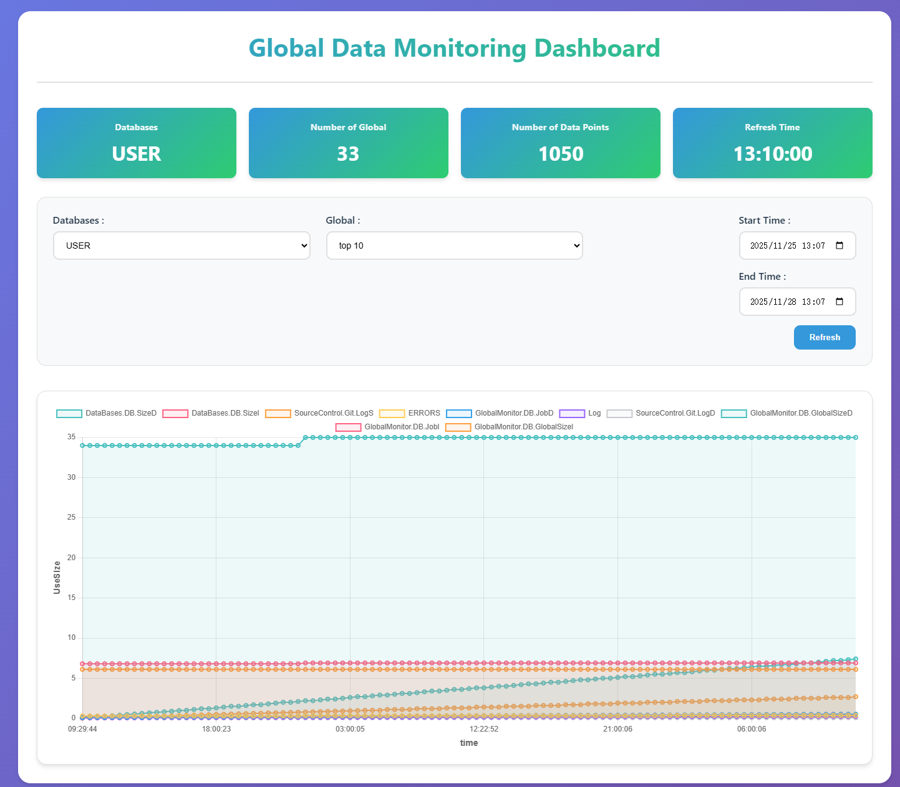

# iris-global-statistics-chart

Use scheduled tasks to compile statistics on the Global data in the database and display the changing trends on a chart.

## Describe 
- The scheduled task uses a process pool to perform statistics on multiple databases and can set the execution frequency of the scheduled task according to requirements.
- By default, display the top 10 Globals with the highest usage
- Can filter by database, global, and time

The interface is shown in the picture below：




## ideas

```
https://ideas.intersystems.com/ideas/DPI-I-747
```
## How to use it

### Prerequisites
Make sure you have git and Docker desktop installed.
### Installation
#### Clone/git pull the repo into any local directory
```
git clone https://github.com/Sara771dev/iris-global-statistics-chart.git
```  
#### Open the terminal in this directory and run

```
docker-compose build
```
#### Run the IRIS container 

```
docker-compose up -d
```

#### Visit the address below
```
http://localhost:52773/csp/user/GlobalMonitor.Page.Chart.cls
```
